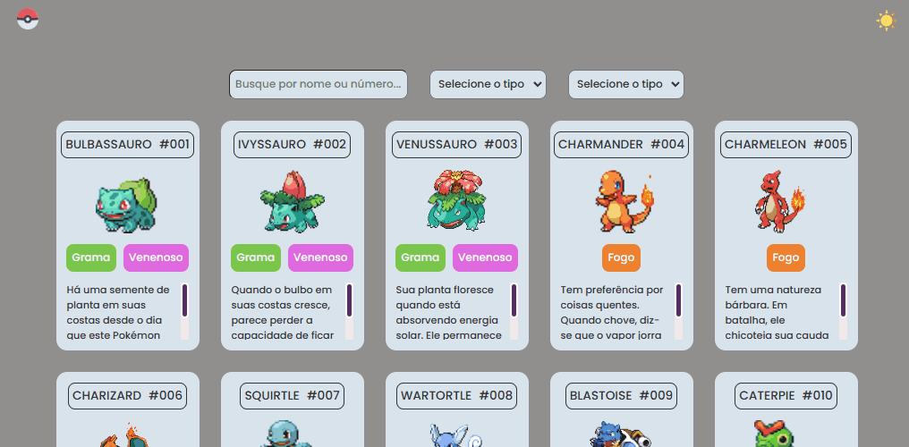

# Pokédex First Gen (151 Pokémon)
## Languages
This first section is in English. 

[Versão em português logo abaixo.](#portuguese)

## Context
Project created from the event "From Zero to Hired Programmer" by [Dev em Dobro](https://www.youtube.com/@DevemDobro) in which they made an entry with the first 10 Pokémon.

From the code developed during this event, I decided to expand to all 151 Pokémon from the first generation of Pokémon, also including a search box by Pokémon name/number or by Pokémon type.

The information for each Pokémon resembles, in a simplified way, the entries used in the Pokédex, presenting information such as name, number (in the first generation), image, types and a brief description of the Pokémon.

## How to use this pokédex
When you access this Pokédex, you can do three things:

1. View the Pokémon in order of their entry numbers in the regional Pokédex of the first generation;

<p align="center">

</p>

2. Search by name/number and/or by the types of the desired Pokémon;

<p align="center">

</p>

3. You can also switch between light/dark mode in the upper right corner;

<p align="center">

</p>

## How to access this pokédex
To access this pokédex, access its web version at https://xuaun.github.io/pokedex-pokemon-ten-list-website/.

## Technologies used
In this project, ```HTML```, ```CSS```, ```JavaScript``` were used.

____
<br>

# <p id="portuguese">Pokédex Primeira Geração Pokémon (151 Pokémon)</p>
## Contexto
Projeto criado a partir do evento "Do Zero ao Programador Contratado" do [Dev em Dobro](https://www.youtube.com/@DevemDobro) em que eles fizeram uma entrada com os 10 primeiros pokémons.

A partir do código desenvolvido durante este evento, decidi expandir para todos os 151 pokémons da primeira geração de pokémon, incluindo também uma caixa de busca por nome/número do pokémon ou pelos tipos do pokémon.

As informações de cada pokémon se assemelham, de maneira simplificada, com as entradas utilizadas na pokédex, apresentando informações como nome, número (na primeira geração), imagem, tipos e uma breve descrição do pokémon.

## Como usar esta pokédex
Ao acessar esta pokédex, você pode fazer três coisas:

1. Visualizar os pokémons em ordem de número de suas entradas na pokédex regional da primeira geração;

<p align="center">
  
</p>

2. Buscar por nome/número e/ou pelos tipos do pokémon desejado;

<p align="center">
  
</p>

3. Você também pode, no canto superior direito, alternar entre o modo claro/escuro;

<p align="center">
  
</p>

## Instruções de onde acessar
Para acessar esta pokédex, acesse sua versão web em https://xuaun.github.io/pokedex-pokemon-ten-list-website/.

## Tecnologias utilizadas
Neste projeto, foi utilizado ```HTML```, ```CSS```, ```JavaScript``` .
